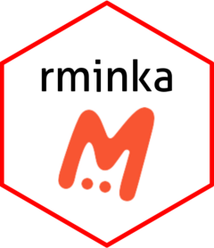

<!-- README.md is generated from README.Rmd. Please edit that file -->

# rminka <a href="https://rpubs.com/rservitje25/1254993"></a>

<!-- badges: start -->

[](https://lifecycle.r-lib.org/articles/stages.html#experimental)
[](https://github.com/Development-BioMarine/rminkav3/actions/workflows/R-CMD-check.yaml)
[](https://CRAN.R-project.org/package=rminkav3)
[](https://app.codecov.io/gh/Development-BioMarine/rminkav3)
<!-- badges: end -->

The goal of rminkav3 is access Minka observations through the API.

## Installation

You can install the development version of rminkav3 from
[GitHub](https://github.com/) with:

``` r
# install.packages("pak")
pak::pak("Development-BioMarine/rminkav3")
```

## Usage

Minka is a citizen science app built for recording, organizing and
sharing naturalistic observations of animals and plants. It allows
anyone to become a researcher and that the observations we make serve
for scientific use. Minka also allows users to create their own
projects.

The link to access Minka’s website is

<https://minka-sdg.org/>

The goals of the `rminka` package are:

1.  Directly access the data stored in Minka to be able to process them
    with R through the API.

2.  Treat the data to be able to use them directly with other packages
    such as `vegan` or `dismo`.

## Using rminka

If you are new to `rminka` you are better off starting with a starting
web page of `rminka` in the github page of the project.

1.  The main page directions is [minkar
    website](https://development-biomarine.github.io/rminkav3/)

2.  The starting web page is [minkar
    starting](https://development-biomarine.github.io/rminkav3/articles/rminkav3.html)

## Getting help

There are two main places to get help with `rminka`:

1.  The [RStudio community](https://forum.posit.co/) is a friendly place
    to ask any questions about ggplot2.

2.  \[Stack Overflow\]\[so\] is a great source of answers to common
    ggplot2 questions. It is also a great place to get help, once you
    have created a reproducible example that illustrates your problem.
